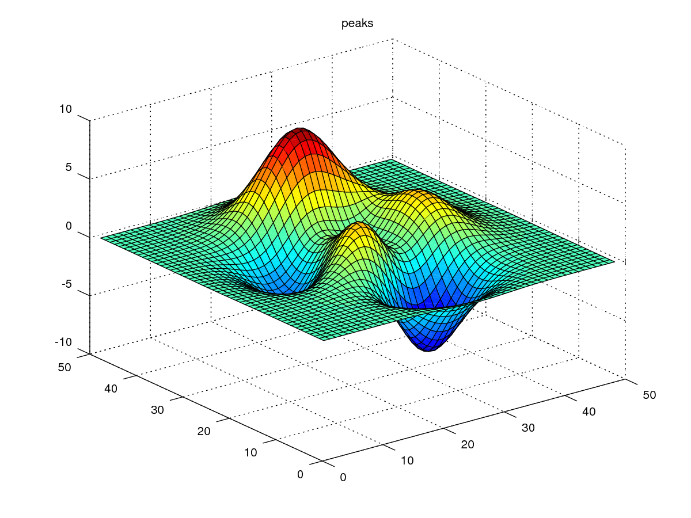
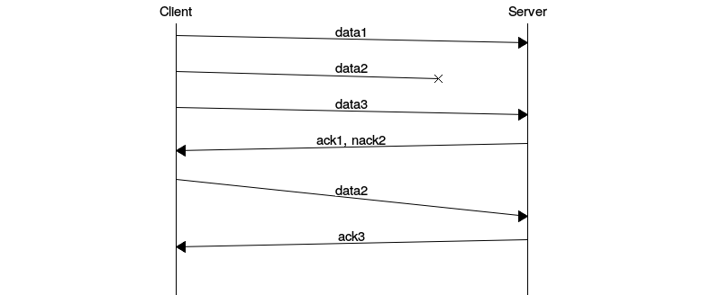

``` {.stdout}
                                          \\\///
                                         / _  _ \
                                       (| (.)(.) |)
                .--------------------.OOOo--()--oOOO.-------------------.
                |                                                       |
                |        ____                          _                |
                |       /  _/____ ___   ____ _ ____ _ (_)____   ___     |
                |       / / / __ `__ \ / __ `// __ `// // __ \ / _ \    |
                |     _/ / / / / / / // /_/ // /_/ // // / / //  __/    |
                |    /___//_/ /_/ /_/ \__,_/ \__, //_//_/ /_/ \___/     |
                |                           /____/                      |
                |                                                       |
                '-------------------.oooO-------------------------------'
                                     (   )   Oooo.
                                      \ (    (   )
                                       \_)    ) /
                                             (_/
```

A pandoc-filter to process codeblocks into images and/or ascii art
------------------------------------------------------------------

Imagine is a pandoc-filter that will turn codeblocks tagged with certain
classes into images or ascii art. The following classes are currently
supported:

    actdiag, asy, asymptote, blockdiag, boxes, circo, ctioga2, ditaa, dot, fdp,
    figlet, flydraw, gle, gnuplot, graph, graphviz, gri, imagine, mermaid, mscgen,
    neato, nwdiag, octave, packetdiag, pic, pic2plot, plantuml, plot, ploticus,
    protocol, pyxplot, rackdiag, seqdiag, sfdp, shebang, twopi

Examples
--------

### *[Octave](https://www.gnu.org/software/octave)*

    ```{.octave imgout="fcb,img" caption="Created by Octave"}
    figure(1, 'visible', 'off');
    surf(peaks);
    title("peaks");
    print(1, argv(){1});
    ```



### [Shebang](http://www.google.com/search?q=linux+shebang) using Python & Pygal

    ```{.shebang imgout="fcb,img" caption="Created by Pygal"}
    #!/usr/bin/env python3
    import sys
    import pygal
    from math import cos
    xy_chart = pygal.XY()
    xy_chart.title = 'XY Cosinus'
    xy_chart.add('x = cos(y)', [(cos(x / 10.), x / 10.) for x in range(-50, 50, 5)])
    xy_chart.add('y = cos(x)', [(x / 10., cos(x / 10.)) for x in range(-50, 50, 5)])
    xy_chart.render_to_png(sys.argv[-1])
    ```


### *[Mscgen](http://www.mcternan.me.uk/mscgen/)*

    ```{.mscgen imgout="fcb,img" caption="Created by mscgen"}
    msc {
     hscale="1.3", arcgradient = "8";

     a [label="Client"],b [label="Server"];

     a=>b [label="data1"];
     a-xb [label="data2"];
     a=>b [label="data3"];
     a<=b [label="ack1, nack2"];
     a=>b [label="data2", arcskip="1"];
     |||;
     a<=b [label="ack3"];
     |||;
    }
    ```



For more examples see the [sample.pdf](examples/sample.pdf).

All details
-----------

``` {.stdout}
class <class 'imagine.Asy'>
class <class 'imagine.BlockDiag'>
class <class 'imagine.Boxes'>
class <class 'imagine.Ctioga2'>
class <class 'imagine.Ditaa'>
class <class 'imagine.Figlet'>
class <class 'imagine.Flydraw'>
class <class 'imagine.Gle'>
class <class 'imagine.GnuPlot'>
class <class 'imagine.Graph'>
class <class 'imagine.Graphviz'>
class <class 'imagine.Gri'>
class <class 'imagine.Imagine'>
class <class 'imagine.Mermaid'>
class <class 'imagine.MscGen'>
class <class 'imagine.Octave'>
class <class 'imagine.Pic2Plot'>
class <class 'imagine.PlantUml'>
class <class 'imagine.Plot'>
class <class 'imagine.Ploticus'>
class <class 'imagine.Protocol'>
class <class 'imagine.PyxPlot'>
class <class 'imagine.SheBang'>

    ```asy
    code
    ```
    =>  asy -o <fname>.<fmt> [<options>] <fname>.asy
    <=  Para(Image)
    
```
