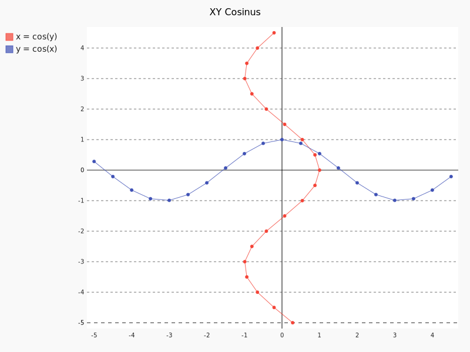

``` {.stdout}
                                          \\\///
                                         / _  _ \
                                       (| (.)(.) |)
                .--------------------.OOOo--()--oOOO.-------------------.
                |                                                       |
                |        ____                          _                |
                |       /  _/____ ___   ____ _ ____ _ (_)____   ___     |
                |       / / / __ `__ \ / __ `// __ `// // __ \ / _ \    |
                |     _/ / / / / / / // /_/ // /_/ // // / / //  __/    |
                |    /___//_/ /_/ /_/ \__,_/ \__, //_//_/ /_/ \___/     |
                |                           /____/                      |
                |                                                       |
                '-------------------.oooO-------------------------------'
                                     (   )   Oooo.
                                      \ (    (   )
                                       \_)    ) /
                                             (_/
```

A pandoc filter to process codeblocks into images and/or ascii art
------------------------------------------------------------------

Imagine is a pandoc filter that will turn codeblocks tagged with certain
classes into images or ascii art. The following classes are currently
supported:

``` {.__doc__}
actdiag, asy, asymptote, blockdiag, boxes, circo, ctioga2, ditaa, dot, fdp,
figlet, flydraw, gle, gnuplot, graph, graphviz, gri, imagine, mermaid, mscgen,
neato, nwdiag, octave, packetdiag, pic, pic2plot, plantuml, plot, ploticus,
protocol, pyxplot, rackdiag, seqdiag, sfdp, shebang, twopi
```

Examples
--------

### *[Mscgen](http://www.mcternan.me.uk/mscgen/)*

    ```{.mscgen imgout="fcb,img"}
    msc {
     hscale="1.3", arcgradient = "8";

     a [label="Client"],b [label="Server"];

     a=>b [label="data1"];
     a-xb [label="data2"];
     a=>b [label="data3"];
     a<=b [label="ack1, nack2"];
     a=>b [label="data2", arcskip="1"];
     |||;
     a<=b [label="ack3"];
     |||;
    }
    ```


### *[Octave](https://www.gnu.org/software/octave)*

    ```{.octave imgout="fcb,img"}
    figure(1, 'visible', 'off');
    surf(peaks);
    title("peaks");
    print(1, argv(){1});
    ```


### *[Shebang](http://www.google.com/search?q=linux+shebang)* using Python & Pygal

    ```{.shebang imgout="fcb,img"}
    #!/usr/bin/env python3
    import sys
    import pygal
    from math import cos
    xy_chart = pygal.XY()
    xy_chart.title = 'XY Cosinus'
    xy_chart.add('x = cos(y)', [(cos(x / 10.), x / 10.) for x in range(-50, 50, 5)])
    xy_chart.add('y = cos(x)', [(x / 10., cos(x / 10.)) for x in range(-50, 50, 5)])
    xy_chart.render_to_png(sys.argv[-1])
    ```



### *[boxes](http://boxes.thomasjensen.com)*

    ```{.shebang imgout="fcb,stdout"}
    #!/bin/bash
    # I seem to have got myself boxed in!
    cat $0 | boxes -d peek -p h4
    ```

``` {.stdout}
/*       _\|/_
         (o o)
 +----oOO-{_}-OOo------------------------------+
 |    #!/bin/bash                              |
 |    # I seem to have got myself boxed in!    |
 |    cat $0 | boxes -d peek -p h4             |
 +--------------------------------------------*/
```

See [sample.pdf](examples/sample.pdf) for more examples.

Documentation
-------------

``` {.__doc__}
Imagine
  A pandoc filter to turn fenced codeblocks into graphics or ascii art by
  wrapping some external command line utilities, such as:

    actdiag, asy, asymptote, blockdiag, boxes, circo, ctioga2, ditaa, dot,
    fdp, figlet, flydraw, gle, gnuplot, graph, graphviz, gri, imagine,
    mermaid, mscgen, neato, nwdiag, octave, packetdiag, pic, pic2plot,
    plantuml, plot, ploticus, protocol, pyxplot, rackdiag, seqdiag, sfdp,
    shebang, twopi


Installation

  1. % sudo pip install pandocfilters
  2. % sudo pip install pandoc-imagine

     or save `pandoc-imagine.py` anywhere along $PATH


Dependencies

  One (or more) of the packages that provide above utilities.


Pandoc usage

    % pandoc --filter pandoc-imagine.py document.md -o document.pdf


Markdown usage

    ```cmd
    code
    ```

  which will run `cmd` to proces the `code` into a png image and replaces the
  fenced code block with an Image in a paragraph of its own or any ascii art in
  its own CodeBlock.

  Alternate, longer form:

    ```{.cmd options=".." imgout=".." prog=<other-cmd>}
    code
    ```

  - options="..." will be passed onto the command line.
    Some classes already provide some defaults (as required by the command).

  - imgout="...", csv-list of keywords each specifying a certain output
    - img     image in a paragraph
    - fcb     codeblock (class __fcb__) containing the original codeblock
    - stdout, codeblock (class __stdout__) containing stdout output (if any)
    - stderr, codeblock (class __stderr__) containing stderr output (if any)

  - prog=<other-cmd>, overrides class-to-command map.
    Only useful if `cmd` itself is not an appropiate class in your document.

  If the command fails, the original fenced code block is retained unchanged.
  Any info on stderr is relayed by Imagine, which might be useful for
  troubleshooting.

  If the command succeeds but produces no image, a line reporting the missing
  Image is included in the output document as output.

  Notes:
  - filenames are based on a hash of the codeblock + its attributes
  - uses subdir `pd-images` to store any input/output files
  - there's no clean up of files stored there
  - if an output filename exists, it is not regenerated but simply linked to.
  - `packetdiag` & `sfdp`s underlying libraries seem to have some problems.

  Some commands follow a slightly different pattern:
  - 'img' directive is ignored by commands that only produce ascii
  - ctioga2 defaults to pdf instead of png
  - flydraw produces a gif, not png
  - gle also creates a .gle subdir inside the images-dir
  - gri produces a ps, which is `convert`ed to png
  - imagine reads its codeblock as help-topics for which a codeblock is returned
  - plot reads its codeblock as the relative path to the file to process
  - pyxplot will have `set terminal` & `set output` prepended to its `code`
  - shebang runs its codeblock as a script with <fname>.png as its argument.
    - use {.shebang imgout="stdout"} for text instead of an png


Security

  Imagine just hands the fenced codeblocks to plotting tools to process or
  simply runs them as system scripts as-is.

  Shebang are inherently unsafe and most of the plotting tools implement their
  own 'little' language which can create beautiful images but can also cause
  harm.

  There is no way to check for 'side effects' in advance, so make sure to check
  the fenced codeblocks before running them through the filter.


Imagine class

The imagine class puts documentation of topics at your fingertips, like so:

    ```imagine
    class
    ```

  Use `imagine` as class to get the module's docstring (ie this text) or one
  of the commands you're interested in.
```

Individual Classes
------------------

``` {.stdout}
Asy

    See http://asymptote.sourceforge.net
    
    Runs asy -o <fname>.png [options] <fname>.asy
    Wraps:
    -  'asymptote' -> asy
    -  'asy' -> asy

BlockDiag

    See http://blockdiag.com
    
    Runs cmd -T png <fname>.txt -o <fname>.png
    Wraps:
    -  'actdiag' -> actdiag
    -  'blockdiag' -> blockdiag
    -  'rackdiag' -> rackdiag
    -  'seqdiag' -> seqdiag
    -  'packetdiag' -> packetdiag
    -  'nwdiag' -> nwdiag

Boxes

    See http://boxes.thomasjensen.com
    
    Runs boxes [options] <fname>.boxes
    Wraps:
    -  'boxes' -> boxes

Ctioga2

    See http://ctioga2.sourceforge.net
    
    Runs ctioga2 [options] -f <fname>.ctioga2
    Wraps:
    -  'ctioga2' -> ctioga2

Ditaa
See http://ditaa.sourceforge.net
    Runs ditaa <fname>.ditaa <fname>.png -T [options]
    Wraps:
    -  'ditaa' -> ditaa

Figlet

    See http://www.figlet.org
    
    Runs figlet [options] < code-text
    Wraps:
    -  'figlet' -> figlet

Flydraw

    See http://manpages.ubuntu.com/manpages/precise/man1/flydraw.1.html
    
    Runs flydraw [options] < code-text
    Wraps:
    -  'flydraw' -> flydraw

Gle

    See http://glx.sourceforge.net
    
    Runs gle -verbosity 0 -output <fname>.<fmt> <fname>.gle
    Wraps:
    -  'gle' -> gle

GnuPlot

    See http://www.gnuplot.info
    
    Runs gnuplot [options] <fname>.gnuplot > <fname>.png
    Wraps:
    -  'gnuplot' -> gnuplot

Graph

    See https://www.gnu.org/software/plotutils
    
    Runs graph -T png [options] <fname>.graph
    Wraps:
    -  'graph' -> graph

Graphviz

    See http://graphviz.org
    
    Runs cmd [options] -T<fmt> <fname>.dot <fname>.<fmt>
    Wraps:
    -  'twopi' -> twopi
    -  'graphviz' -> dot
    -  'fdp' -> fdp
    -  'circo' -> circo
    -  'neato' -> neato
    -  'dot' -> dot
    -  'sfdp' -> sfdp

Gri

    See http://gri.sourceforge.net
    - requires `convert` from imagemagick
    
    Runs gri -c 0 -b <fname>.gri
    Wraps:
    -  'gri' -> gri

Imagine

    See https://github.com/hertogp/imagine
    
    Runs return documentation in a CodeBlock
    Wraps:
    -  'imagine' -> imagine

Mermaid

    See https://knsv.github.io/mermaid (needs phantomjs)
    - requires phantomjs.
    
    Runs mermaid -o <basedir> [options] <fname>.mermaid
    Wraps:
    -  'mermaid' -> mermaid

MscGen

    See http://www.mcternan.me.uk/mscgen
    
    Runs mscgen -T png -o <fname>.png <fname>.mscgen
    Wraps:
    -  'mscgen' -> mscgen

Octave

    See https://www.gnu.org/software/octave
    
    Runs octage --no-gui -q [options] <fname>.octave <fname>.png
    Wraps:
    -  'octave' -> octave

Pic2Plot

    See https://www.gnu.org/software/plotutils
    
    Runs pic2plot -T png [options] <fname>.pic2plot
    Wraps:
    -  'pic2plot' -> pic2plot
    -  'pic' -> pic2plot

PlantUml

    See http://plantuml.com
    
    Runs plantuml -t png <fname>.plantuml
    Wraps:
    -  'plantuml' -> plantuml

Plot

    See https://www.gnu.org/software/plotutils
    
    Runs plot -T png [options] <code-text-as-filename>
    Wraps:
    -  'plot' -> plot

Ploticus

    See http://ploticus.sourceforge.net/doc/welcome.html
    
    Runs ploticus -png -o <fname>.png [options] <fname>.ploticus
    Wraps:
    -  'ploticus' -> ploticus

Protocol

    See https://github.com/luismartingarcia/protocol.git
    
    Runs protocol [options] code-text
    Wraps:
    -  'protocol' -> protocol

PyxPlot

    See http://pyxplot.org.uk
    
    Runs pyxplot [options] <fname>.pyxplot
    Wraps:
    -  'pyxplot' -> pyxplot

SheBang

    See http://www.google.com/search?q=shebang+line
    
    Runs <fname>.shebang [options] <fname>.png
    Wraps:
    -  'shebang' -> shebang

```
