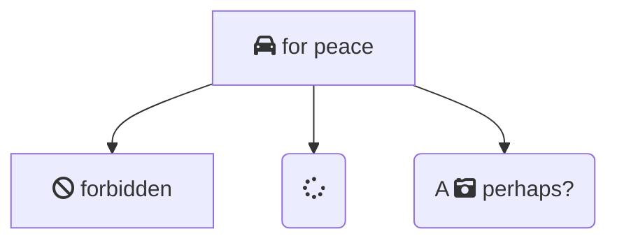

```{.shebang im_out="stdout"}
#!/bin/bash
echo "mermaid" | figlet -c -f doom -w 50 | boxes -d ian_jones -ph4v1 -i box -a hcvc
```

```imagine
mermaid
```

Notes:

- See [*mermaidjs page*](https://mermaidjs.github.io/)
- svg requires rsvg-convert (librsvg2-bin)

\newpage

# Examples

## Ehmm



\newpage

## sequenceDiagram (svg)

```{.mermaid im_opt="-H 300" im_fmt="svg"}
sequenceDiagram
    Alice ->> Bob: Hello Bob, how are you?
    Bob-->>John: How about you John?
    Bob--x Alice: I am good thanks!
    Bob-x John: I am good thanks!
    Note right of John: Bob thinks a long<br/>long time, so long<br/>that the text does<br/>not fit on a row.

    Bob-->Alice: Checking with John...
    Alice->John: Yes... John, how are you?
```

\newpage

# Documentation

## mmdc -h
```{.shebang im_out="stdout"}
#!/bin/bash
mmdc -h | fold -w 75
```


