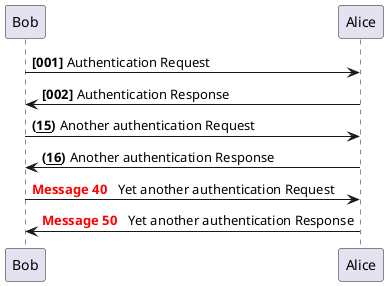
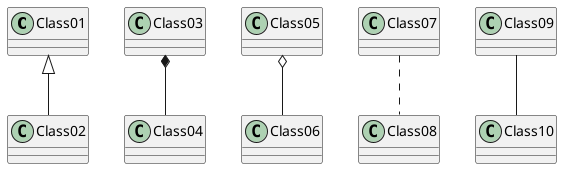
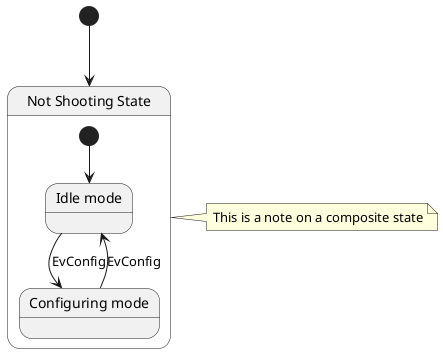

---
imagine.plantuml.im_opt: "width=60%"
imagine.plantuml.im_fmt: svg
...

```{.shebang im_out="stdout"}
#!/bin/bash
figlet -c -w 60 plantuml | boxes -d ian_jones -ph4v1 -i box
```

```imagine
plantuml
```

Notes:

- metadata sets plantuml's default output format to `svg`
- local install doesn't seem to support mindmap  
  see `plantuml -language | grep -i @`

\newpage

# Local installation

```{.shebang im_out="stdout"}
#!/bin/bash
uname -o
uname -rv
echo
apt show plantuml
```

\newpage

# Examples

## Sequence diagram (svg)



\newpage

## Class diagrams (svg)



\newpage

## Notes (svg)



\newpage

# Documentation

## plantuml -h

```{.shebang im_out="stdout"}
#!/bin/bash
plantuml -h
```

\newpage

## man page

```{.shebang im_out="stdout"}
#!/bin/bash
MANWIDTH=75 man plantuml | col -bx | iconv -t ascii//TRANSLIT
```
